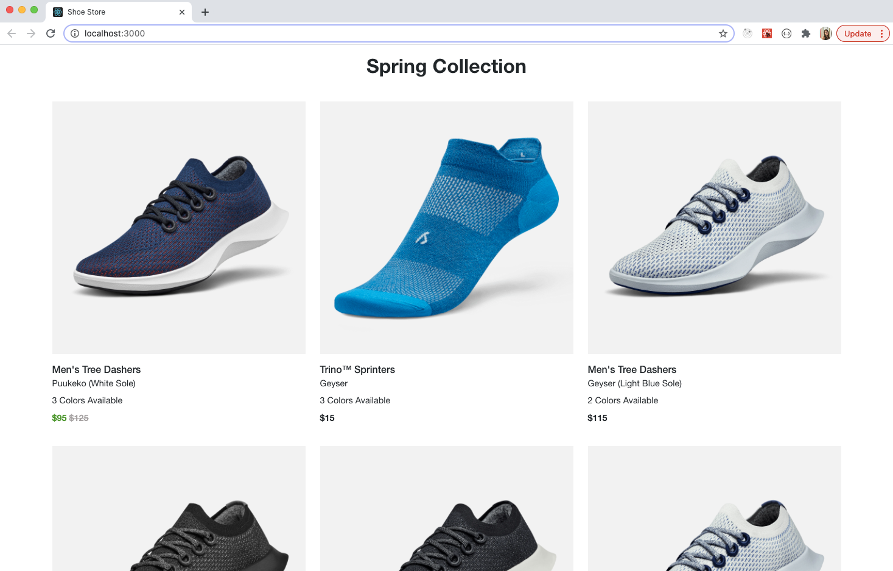

# Product Gallery Page Using React | CSS

## Set Up
 * Clone this repo into your local computer using the ssh key
 * CD into the repo
 * Run 'npm install' to install all dependencies
 * Run 'npm start' and confirm 'Yes' which will open your web browser and start the application
 
 ## Screenshot 📷
 </img>
